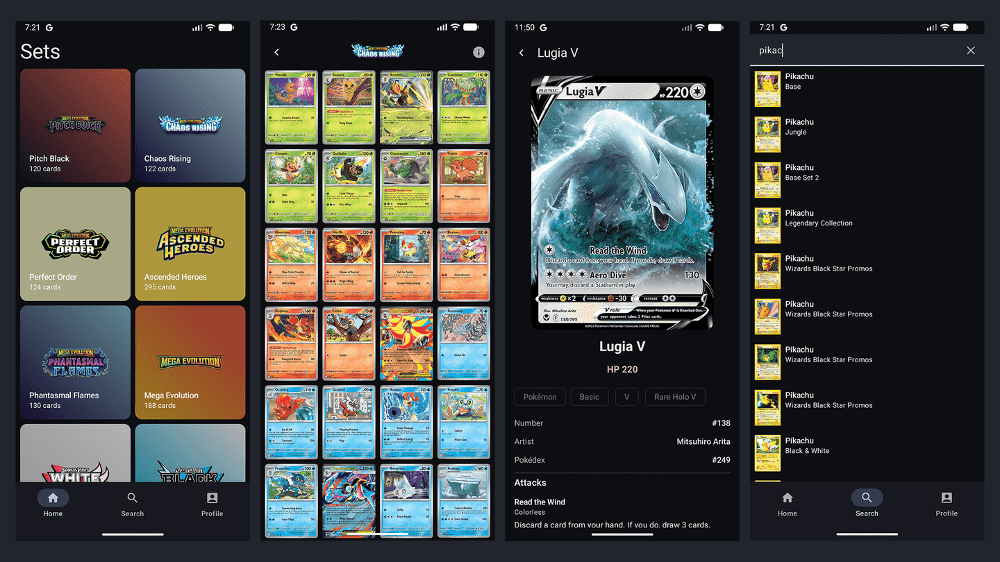

# PokeTCG

Android app for browsing Pokémon TCG sets and cards.

> **Status:** work in progress — some flows and error handling may still be incomplete.

## Motivation

Inspired by [Now in Android](https://github.com/android/nowinandroid), this project is practice for official [Android Architecture](https://developer.android.com/topic/architecture) guidance and Google-recommended libraries (Jetpack Compose, Hilt, Room, Paging, Navigation, Retrofit/OkHttp, Coil, and so on).

## Screenshots

## API

The original integration targeted the [Pokémon TCG API](https://docs.pokemontcg.io/), which turned out to be unreliable at times. After checking with the community on Discord, I learned the maintainer is deprecating that service and folding it into a paid offering — while leaving open the card database repo, which remains updated.

To work around that, I built a companion backend that serves this data: [API backend](https://github.com/lfgtavora/poketcg-api).

## Stack & structure

- Modular `app` / `core` / `feature` layout (Now in Android style)
- Compose + Material 3, Hilt, Room, Paging, Navigation
- UI tests with [Maestro](.maestro/README.md)
